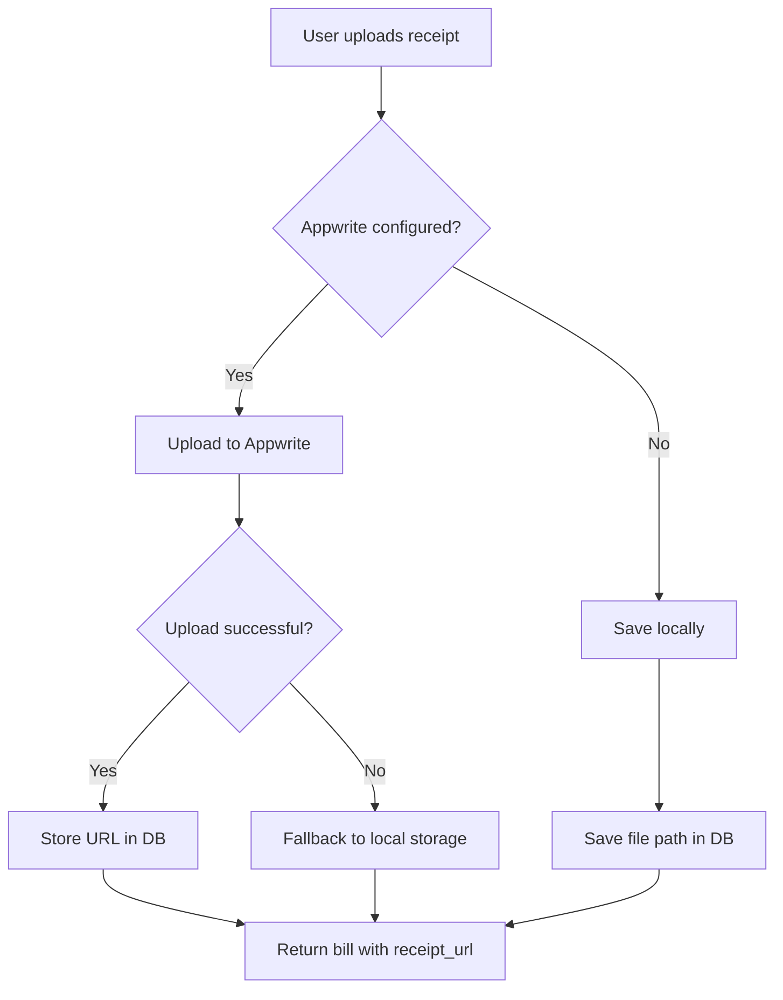

# Money Buddy - Appwrite Storage Integration Guide

## Overview

Money Buddy now supports **Appwrite** as an optional cloud storage backend for bill receipts. When configured, uploads are stored in Appwrite instead of local disk storage. The system automatically falls back to local storage if Appwrite is not configured or fails.

## Features

✅ **Cloud Storage**: Store receipts securely in the cloud  
✅ **Automatic Fallback**: Falls back to local storage if Appwrite is unavailable  
✅ **Easy Setup**: Configure with just a few environment variables  
✅ **Seamless Migration**: Existing local files continue to work  

## Quick Start

### 1. Get Your Appwrite Credentials

1. Go to [Appwrite Dashboard](https://app.appwrite.io)
2. Create a new project (or use existing one)
3. Navigate to **Settings** → **API Keys**
4. Copy your:
   - Project ID
   - API Key

### 2. Configure Environment Variables

Add these to your `.env` file in the `backend/` directory:

```bash
# Appwrite Storage Configuration (Optional)
APPWRITE_ENDPOINT=https://cloud.appwrite.io/v1
APPWRITE_PROJECT_ID=your_project_id_here
APPWRITE_API_KEY=your_api_key_here

# Optional: Customize storage settings
APPWRITE_STORAGE_BUCKET=money-buddy
APPWRITE_STORAGE_FILE_COLLECTION=receipts
```

### 3. Create Storage Bucket (One-time setup)

In your Appwrite dashboard:

1. Go to **Storage** → **Buckets**
2. Click **Create bucket**
3. Name it `money-buddy` (or the name you configured above)
4. Set permissions as needed (public read is recommended for receipts)

## How It Works

### Upload Flow



### Database Schema Changes

The `Bill` model now has two fields:

- **`receipt_path`**: Local file path (deprecated but still supported)
- **`receipt_url`**: Cloud storage URL (Appwrite, etc.)

## API Endpoints

### Upload Receipt

```http
POST /api/bills/{bill_id}/receipt
Content-Type: multipart/form-data

File: <receipt_file>
```

**Response:**
```json
{
  "id": 123,
  "name": "Electric Bill",
  "amount": 150.00,
  "receipt_url": "https://xyz.appwrite.io/storage/buckets/money-buddy/files/abc-123-def-456",
  ...
}
```

### Delete Bill (Auto-cleans receipts)

When deleting a bill or user account:
- Local files are deleted from disk
- Appwrite storage files are deleted by file ID extracted from the URL

## Configuration Options

### Environment Variables

| Variable | Default | Description |
|----------|---------|-------------|
| `APPWRITE_ENDPOINT` | `https://cloud.appwrite.io/v1` | Appwrite API endpoint |
| `APPWRITE_PROJECT_ID` | *(required)* | Your Appwrite project ID |
| `APPWRITE_API_KEY` | *(required)* | Your Appwrite API key |
| `APPWRITE_STORAGE_BUCKET` | `money-buddy` | Storage bucket name |
| `APPWRITE_STORAGE_FILE_COLLECTION` | `receipts` | Collection for organizing files |

### File Upload Limits

| Setting | Default | Description |
|---------|---------|-------------|
| `MAX_UPLOAD_SIZE_MB` | 10 | Maximum file size in MB |
| Allowed extensions | jpg, jpeg, png, gif, webp, pdf | Supported file types |

## Troubleshooting

### Appwrite Upload Fails

**Symptoms:** Receipt uploads fail silently and fall back to local storage.

**Solutions:**
1. Check that `APPWRITE_PROJECT_ID` and `APPWRITE_API_KEY` are set correctly
2. Verify the API key has **Storage** permissions in Appwrite dashboard
3. Check backend logs for error messages:
   ```bash
   docker compose logs backend 2>&1 | grep -i "appwrite\|upload"
   ```

### Local Storage Still Used

If you see receipts saved locally despite having Appwrite configured:

1. The API key might be invalid or expired
2. Network issues preventing connection to Appwrite
3. Check the logs for fallback messages: `Appwrite upload failed`

## Migration from Local Storage

No migration needed! The system is backward compatible:

- Existing bills with `receipt_path` continue to work
- New uploads use cloud storage if configured
- You can switch between local and cloud anytime by toggling environment variables

## Security Notes

⚠️ **Important:** Never commit your `.env` file to version control!

The Appwrite API key should have minimal permissions:
- ✅ Storage: Read/Write on specific bucket
- ❌ Database access
- ❌ User management
- ❌ Function execution

To set up restricted permissions in Appwrite:
1. Create a **Function** with storage-only scope
2. Use that function's API key instead of project-wide key
3. Or create a dedicated service account for Money Buddy

## Testing

### Test Local Storage (Default)

```bash
# Remove Appwrite config to use local storage
APPWRITE_PROJECT_ID=
APPWRITE_API_KEY=

docker compose up --build backend
```

Upload a receipt - it should save locally in `/uploads/`.

### Test Cloud Storage

```bash
# Add your Appwrite credentials
APPWRITE_PROJECT_ID=your_project_id
APPWRITE_API_KEY=your_api_key

docker compose restart backend
```

Upload a receipt - it should now be stored in Appwrite and return a cloud URL.

## Development Notes

The implementation includes:

1. **`app/core/appwrite_config.py`**: Configuration management with lazy client initialization
2. **`app/services/appwrite.py`**: Storage service with upload/delete/get operations
3. **Updated `upload_receipt()` endpoint**: Dual-path logic (Appwrite → Local fallback)
4. **Enhanced cleanup routines**: Delete both local files and cloud storage when needed

## Future Enhancements

Potential improvements:

- [ ] Add file preview functionality in frontend using Appwrite URLs
- [ ] Implement thumbnail generation for images
- [ ] Add file versioning (keep old receipts on update)
- [ ] Support multiple cloud providers (AWS S3, Google Cloud Storage)
- [ ] Add CDN integration for faster image loading

## License & Credits

This integration was added to Money Buddy by the development team.  
Appwrite is provided by [Appwrite](https://appwrite.io).
